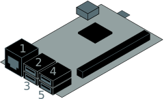

# helotism
Yet Another Raspberry Pi cluster

To install a minimal cluster with a minumum of hassle this project provides an installation routine for

- a central master server
- several nodes

These need to be connected with a switch and powered as usual.

It is recommended to add:

- a RTC clock via I2C
- a button that triggers a shutdown of all connected nodes

The master server is also a node by default, but additionally provides

- a DHCP server
- a NTP server
- DNS resolution
- routing capabilities for the nodes

To connect to the outside world this board detects a USB ethernet adapter on one of the four USB ports. The installation cannot finish without such an adapter.

The locations 2-5 show where the USB to Ethernet Adapter is automatically recognized on the master node.

## Installation

See [-> Installation](./application/physical/installation.md "Installation")