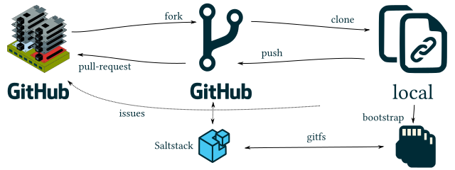

The original repo holds a bootstrap script that asks all basic cutomization questions. But as the configuration management Saltstack also references a remote Git repo the recommended workflow is to fork the original repo first.



## The Ingredients ##

To install a minimal cluster the following parts are needed:

- 2 or 3 Raspberry Pi 2|3 Model B
- 2 or 3 SD cards of 4 GB and bigger (may be different sizes)
- 1 Switch, e.g. an 8-port
- 1 USB Ethernet adapter
- 1 power supply
- cables

Recommended additions are

- PiSupply Power on/Off Switch [link to webshop](https://www.pi-supply.com/product/pi-supply-raspberry-pi-power-switch/ "webshop") (can be custom-made as per [this article](http://www.raspberry-pi-geek.com/Archive/2013/01/Adding-an-On-Off-switch-to-your-Raspberry-Pi/(offset)/2))


## An Installation Transcript ##

Forking can be done on the command line with curl. The fork will be made to your personal account this way.

```bash
echo "Type in your GitHub username and [Enter]:"

read yourUserName

curl -u "$yourUserName" -X POST https://api.github.com/repos/helotism/helotism/forks

```

>Enter host password for user '$yourUserName':

```
git clone https://github.com/$yourUserName/helotism.git

```

>Cloning into 'helotism'...
>remote: Counting objects: 773, done.
>remote: Compressing objects: 100% (126/126), done.
>remote: Total 773 (delta 47), reused 0 (delta 0), pack-reused 639
>Receiving objects: 100% (773/773), 27.62 MiB | 413.00 KiB/s, done.
>Resolving deltas: 100% (164/164), done.
>Checking connectivity... done.
>Checking out files: 100% (506/506), done.

Switch to a tagged version:

```
cd helotism
git checkout v2016.6
```

And start the bootstrap script:

```
./application/physical/scripts/bootstrap-arch.sh
```

It has been tested on Ubuntu 16.04 but should work in any bash shell. It tests for these programs and exits if its dependecies are not met:

- wget
- fdisk
- curl
- bsdtar
- dd
- git
- lsblk

Although it can be started as non-root it asks for `sudo` rights straight away. It is going to write to a block device, no way around it.

### Section 1: Prompting for Configuration Items ###

Emphasis added. It is not the nicest output (yet).

The script suggests default values but they can be overwritten. The cluster will be configured to use the values you enter here.

Choices in capital letters are the default value when no input is made. Example:

>Do you want to continue? [Yn] 

Just hitting [Enter] is the same as typing `y` or `Y`.

>
>[sudo] password for cpr: 
>
>Welcome to the bootstrap script for a Raspberry Pi cluster!
>
>**There will be additional prompts before anything gets overwritten.**
>
>Do you want to continue? [Yn] 
>
>The config management pulls in defaults from a remote Git repo.
>Only https:// links are allowed as otherwise SSH keys are involved.
>This is technically possible but out of scope of this script.
>
>What Git repository do you want to reference? **https://github.com/YOUR-USER-NAME/helotism.git**
>
>Which branch: **v2016.6**
>
>How many cluster nodes in total shall be generated onto SD cards? [1-9] **3**
>
>Enter hostname for a master server: **axle**
>
>Enter the hostname prefix of the nodes.
>They will be appended with an integer, like 'spoke03': **spoke0**
>
>Currently only /24 subnets are accepted.
>Enter a IPV4 address and prefix for this master: **10.16.6.1/24**
>
>Start of a range for addresses handed out via DHCP : **10.16.6.100**
>
>End of a range for addresses handed out via DHCP : **10.16.6.200**
>
>Enter a dedicated fully qualified subdomain.
>The cluster nodes will be like 'spoke03.wheel.prdv.de': **wheel.example.com**
>
>Is the SD card removed from the reader? [yN] **y**
>
>Please insert the SD card into the reader.
>Is the SD card inserted into the reader? [yN] **y**
>
>End of input phase.

### Section 2: Writing to SD cards (repeatedly) ###

A subscript is now called with all parameters to write an ArchLinuxARM installation to several SD cards.

The first SD card is going to be a special one holding the central master server who provides additional services like DHCP and NTP.

By removing and re-inserting the SD card at specific moments when prompted the script detects the newly available block device of the SD card and writes to it.

Should by any unforeseeable accident two block devices appear in the computer the commands like `mount` and `dd` should fail and no harm be done.

>
>Please insert the SD card no. 1 into the reader for: axle
>Press s to skip.
>Is the SD card inserted into the reader? [yNs] **y**
>
>This script wants to overwrite the block device /dev/mmcblk0 with ArchLinuxARM-rpi-2-latest.
>Overwrite /dev/mmcblk0? [yN] **y**

The first run will download the latest ArchLinuxARM tarball. In the future it is only downloaded when an update is available.

>File ArchLinuxARM-rpi-2-latest.tar.gz existing, checking for updates.
>The file data/incoming/archlinuxarm/ArchLinuxARM-rpi-2-latest.tar.gz was already up-to-date.
>
>Creating partition table on /dev/mmcblk0.
>
>Creating filesystems.
>
>Copying to device /dev/mmcblk0.
>
>Setting up boot partition..
>
>Setting hostname to axle.wheel.prdv.de.
>
>Setting salt master to axle.
>
>Final step: Synchronizing data to SD card. May take a minute or so.

If the newly created partitions are [n]ot unmounted on the request of the user then they need to be manually unmounted before the next SD card is inserted. The script will wait at the next prompt anyways.

But sometimes it is nice to be able to make own changes to the filesystem. If not needed: [Enter].

>To make changes to the SD card the partitions can be left mounted.
>In another shell one could make changes to the filesystem.
>The changes need to be made before the next SD card is written to, of course.
>Unmount? [Yn] **y**
>
>Finished!
>
>As per [https://archlinuxarm.org/platforms/armv8/broadcom/raspberry-pi-3](https://archlinuxarm.org/platforms/armv8/broadcom/raspberry-pi-3) , do:
>Insert the SD card into the Raspberry Pi, connect ethernet, and apply 5V power.
>Use the serial console or SSH to the IP address given to the board by your router.
>
> - Login as the default user alarm with the password alarm.
> - The default root password is root.
>
>Login as root, followed by:
>
>`pacman -Syu --noconfirm; pacman -S --noconfirm python2-pygit2; curl -o bootstrap_salt.sh -L https://bootstrap.saltstack.com --silent -k; sleep 2; sh bootstrap_salt.sh -U -i axle -A axle -M git v2016.3.0; sleep 60; salt-key -A -y; echo 'Sleeping 60 seconds to settle down salt.'; sleep 60; salt 'axle' state.apply dnsmasq; salt 'axle' state.apply ntp-server; salt 'axle' state.apply common; salt 'axle' state.apply power-button; timedatectl set-ntp true;`
>
>This was written into the bash history of the root user. Login as root and press the arrow up key.

Now that was the (current) poor man's implementation of a firstboot setup: This first SD card needs to be inserted into its board and powered up with a means of making keyboard input.

Several ways could be used:

- Attaching a monitor and keyboard
- connecting an additional computer with an ethernat cable to the switch and configuring this additional computer with a fixed IP address in the chosen network segment, but outsides of the DHCP range. If all default values were accepted, 10.16.6.254 is a valid choice, or 10.16.6.99 or similar.


### Section 3: The cards for the nodes ###

For the sake of completeness here the output of the 

>Please insert the SD card no. 2 into the reader for: spoke01
>Press s to skip.
>Is the SD card inserted into the reader? [yNs] y
>
>
>This script wants to overwrite the block device /dev/mmcblk0 with ArchLinuxARM-rpi-2-latest.
>Overwrite /dev/mmcblk0? [yN] y
>
>
>File ArchLinuxARM-rpi-2-latest.tar.gz existing, checking for updates.
>The file data/incoming/archlinuxarm/ArchLinuxARM-rpi-2-latest.tar.gz was already up-to-date.
>
>
>Creating partition table on /dev/mmcblk0.
>
>Creating filesystems.
>
>Copying to device /dev/mmcblk0.
>
>Setting up boot partition..
>
>Setting hostname to spoke01.wheel.prdv.de.
>
>Setting salt master to axle.
>
>Final step: Synchronizing data to SD card. May take a minute or so.
>
>To make changes to the SD card the partitions can be left mounted.
>In another shell one could make changes to the filesystem.
>The changes need to be made before the next SD card is written to, of course.
>Unmount? [Yn] **y**
>
>Finished!
>
>As per [https://archlinuxarm.org/platforms/armv8/broadcom/raspberry-pi-3](https://archlinuxarm.org/platforms/armv8/broadcom/raspberry-pi-3) , do:
>Insert the SD card into the Raspberry Pi, connect ethernet, and apply 5V power.
>Use the serial console or SSH to the IP address given to the board by your router.
>
> - Login as the default user alarm with the password alarm.
> - The default root password is root.
>
>Login as root, followed by:
>`pacman -Syu --noconfirm; curl -o bootstrap_salt.sh -L https://bootstrap.saltstack.com --silent -k; sleep 2; sh bootstrap_salt.sh -U -i spoke01 -A axle git v2016.3.0; timedatectl set-ntp true;`
>
>This was written into the bash history of the root user. Login as root and press the arrow up key.

And the last of the three nodes:

>Please insert the SD card no. 3 into the reader for: spoke02
>Press s to skip.
>Is the SD card inserted into the reader? [yNs] **y**
>
>
>This script wants to overwrite the block device /dev/mmcblk0 with ArchLinuxARM-rpi-2-latest.
>Overwrite /dev/mmcblk0? [yN] **y**
>
>File ArchLinuxARM-rpi-2-latest.tar.gz existing, checking for updates.
>The file data/incoming/archlinuxarm/ArchLinuxARM-rpi-2-latest.tar.gz was already up-to-date.
>
>Creating partition table on /dev/mmcblk0.
>
>Creating filesystems.
>
>Copying to device /dev/mmcblk0.
>
>Setting up boot partition..
>
>Setting hostname to spoke02.wheel.prdv.de.
>
>Setting salt master to axle.
>
>Final step: Synchronizing data to SD card. May take a minute or so.
>To make changes to the SD card the partitions can be left mounted.
>In another shell one could make changes to the filesystem.
>The changes need to be made before the next SD card is written to, of course.
>Unmount? [Yn] **y**
>
>
>Finished!
>
>As per [https://archlinuxarm.org/platforms/armv8/broadcom/raspberry-pi-3](https://archlinuxarm.org/platforms/armv8/broadcom/raspberry-pi-3) , do:
>Insert the SD card into the Raspberry Pi, connect ethernet, and apply 5V power.
>Use the serial console or SSH to the IP address given to the board by your router.
>
> - Login as the default user alarm with the password alarm.
> - The default root password is root.
>
>Login as root, followed by:
>`pacman -Syu --noconfirm; curl -o bootstrap_salt.sh -L https://bootstrap.saltstack.com --silent -k; sleep 2; sh bootstrap_salt.sh -U -i spoke02 -A axle git v2016.3.0; timedatectl set-ntp true;`
>
>This was written into the bash history of the root user. Login as root and press the arrow up key.

## Finalizing the Installation ##

When the SD cards boot up for the first time, they are still a plain ArchLinuxARM installation with some configuration files added or changed.

Although there are technical possibilities to detect a firstboot the last step is left for the cluster adminstrator (the "user" just got an upgrade!) to do manually.

What needs to be done has been written into the .bash_history of the root user. So after a login all there is to do is press [Arrow Up] and [Enter].

The output is quite verbose as it also contains a `pacman -Syu` system upgrade.

It is recommended to wait for the central master server to finish first, before booting the nodes at all:

- [x] finish the master server installation
- [ ] continue with the nodes' installation

If an error occurs: [Raise an issue](https://github.com/helotism/helotism/issues)!

For a less user-centric description see [Anatomy of the Bootstrap Script](/application/physical/bootstrap-arch_anatomy)