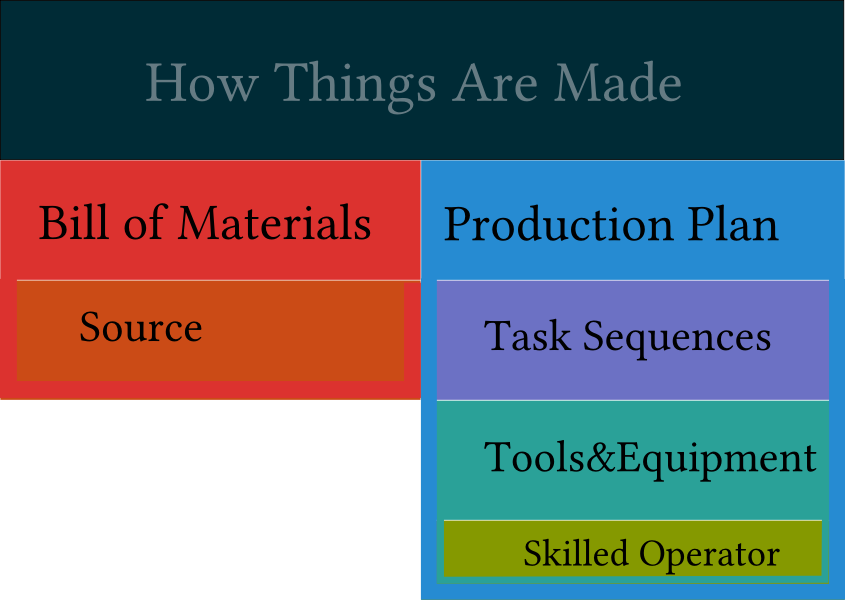

How Things Are Made
===================

A thorough production planning also documents for future repetitions or maintenance. All ERP systems will combine the following components in a more or less elaborate way.

The digitalization of production processes has opened cost-efficient purchasing sources also for the do-it-yourself maker. Software such as Fritzing produces files for professional PCB production runs even for batch sizes of one. But most projects in the spirit of the Maker movement will be more than just an assembly of items.

Thinking from the ground up is a useful exercise contrary to the usual way of "ordering the biggest parts and see where it goes". Rather the available tools and how good one is with them should be the first focus. As with all hobby projects this is also perfect to learn a new tool or an advanced usage, YouTube has tutorials where even seasoned experts may always learn a new trick or two.

The production plan
-------------------

In ERP lingo this is called a *production plan* or work plan or just flow chart. It contains the *sequence of tasks* in the manufacturing process (frequently in verbs like welding, sanding or measuring) and the *tools* or *machines* or *equipment* needed for this step. Advanced usage of this data generates the capacity utilization of a shop and as a result the delivery time may be approximated. Each tool or machine is *operated by some skilled person* and in hobby projects there is no danger of being fired at all (and in an enterprise setting one will also find that training and education is usually the most successful path to bridge gaps).

If a hobby project requires a tool that is not available, one might
buy this tool
substitute the task
or just buy the final part

This reads trivial but within a decade an inceredible spectrum of possibilities can be built up, even in severely limited settings. Woodworkers can go a long qway in furniture building if they can cut at an angle of 45 degrees, make a slot and drill bigger holes vertically. Power tools that require substantial money and space can be substituted by hand tools (with their additional benefit of being silent and not acting as a dust blower.

Similarly the ability to tap an inside thread into metal is an incredible useful basic technique to build up to that enables many structural things to be build, substituting even the need for welding.

This less-obvious approach with the focus on the *production plan* and not immediately on the purchase list of a bill-of-material is what seperates the Maker from the consumer.

Bill of Materials
-----------------

Of course even the most skilled Maker cannot produce stuff out of nothing so it goes without saying that a *bill of material* is indispensable. Even when paying for plans from magazines or for otherwise expertedly constructed projects they will unconciously tell if a project is feasible or not.

But most BOMs fall short: Only major components are listed and small items such as screws or cable omitted. Additionally to that there is a fine distinction between tools and consumables: Should a non-standard drill bit for M2.5 be part of the BOM or hidden in a lengthy description that serves as a work plan? can it be assumed that a wood worker has plenty of sanding paper at hand to finish a big surface? And even companies will struggle when they try to manage their cables for wire harnesses or cut pieces from material where for example a sheet bought in square meters is transformed into an item quantified as pieces.

Even in the smallest DIY project purchase information with article numbers not just from the original manufacturer but also the part number from the particular shop are of great value. It provides a basic cost accounting and makes it easy to replenish or replace at a later time.

Even a simple spreadsheet may also self-reference its own parts creating a (simple) hierarchy of components within a project.

And almost immediately at least a folder-based filesystem structure of related documents will emerge. Whether redundant in each project or in a central storage location the drawings of a part, the datasheets or hyperlinks to resources are invaluable for others and for own reference at a later time. This is not easy and even manufacturing companies will strugle with this, especially when it is a one-off production.

Published online these information will enable people less skilled or just skilled in a different area of expertise have a better chance to reproduce a project.
